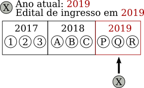

## Aspectos

### Dinamismo do Ranking

O ranking de bolsas, deve ser **recomputado** conforme alunos realizam atividades que atribuem pontuação (e.g., publicações, prêmios, ...)?

1. **Estático** (computado no momento da seleção)  
   Diff na redação dos discentes: _____
2. **Dinâmico** dentro de uma **janela** de tempo  
   Proposta dos discentes: janela é o período de ingresso do edital: _____
3. **Dinâmico** sem janela de tempo  
   Diff na redação dos discentes: _____
4. **Dinâmico**, **zerando** a pontuação da seleção (todos são iguais)
5. Outro: _____

### Dinamismo por modalidade

1. O ranking dinâmico deve se aplicar apenas ao **doutorado**  
   Proposta dos discentes:  _____
2. O ranking dinâmico deve se aplicar apenas ao **mestrado**  
   Diff na redação dos discentes: _____ 
3. O ranking dinâmico deve se aplicar a **ambas** modalidades  
   Diff na redação dos discentes:  _____
4. Outro: _____

### Re-usar critérios da seleção

1. Uso integral do ranking de seleção  
   Diff na redação dos discentes: _____
2. Uso apenas de critérios mecanizáveis  
   Proposta dos discentes: _____
3. Uso apenas de critérios relativos a publicação  
   Diff na redação dos discentes: _____
4. Criar novos critérios para o ranking
5. Outro: _____

### Solicitação tardia de bolsa dentro do período

O aluno cujo edital pelo qual foi aceito previa ingresso em um certo período (ex: 1º e 2º semestres de 2018) e o aluno não solicitou bolsa durante o processo seletivo. Agora ele solicita bolsa dentro do período de ingresso do edital (qualquer momento entre o resultado da seleção e 31/12/2018)

1. Aluno é inserido **antes** de qualquer aluno ingressante no mesmo período  
   
2. Aluno é inserido como se tivesse solicitado bolsa **durante** a seleção  
   Proposta dos discentes: _____  
   
3. Aluno é inserido **após** todos os alunos ingressante no mesmo período  
   Diff na redação dos discentes: _____  
   
4. Outro: _____

### Solicitação tardia de bolsa

O aluno cujo edital pelo qual foi aceito previa ingresso em um certo período (ex: 1º e 2º semestres de 2018) e o aluno não solicitou bolsa durante o processo seletivo. Agora ele solicita bolsa **após o período de ingresso do edital**, ou seja, após 1/1/2019 se o período do edital era o **ano** de 2018.

1. Aluno é inserido como se tivesse solicitado **durante** o processo seletivo  
   Diff na redação dos discentes: _____  
   
2. Aluno é inserido **após** os alunos do seu período de **ingresso**  
   Diff na redação dos discentes: _____  
   
3. Aluno é inserido **antes** dos alunos do período **corrente**  
   Diff na redação dos discentes: _____  
   
4. Aluno é inserido **após** os alunos do período **corrente**  
   Proposta dos discentes: _____  
   
5. Outro: _____

### Regularmente matriculado mas inapto ao recebimento de bolsa

Há uma bolsa disponível e pela fila um aluno **regularmente matriculado** foi selecionado para recebê-la. Por qualquer motivo que seja, o aluno não está apto a receber a bolsa (vínculo empregatício, em viagem, des-interesse temporário, discordância com regras do órgão de apoio)

1. Aluno é removido da fila.
2. Aluno permanece na fila.
   Proposta dos discentes: _____  
3. Aluno permanece na fila, mas na Xª notificação de bolsa disponível rejeitada é removido da fila
4. Após a primeira notificação rejeitada, o aluno pode permanecer rejeitando notificações por até X meses. Após esse prazo, uma notificação de bolsa não aceita implicará em sua remoção da fila.
5. Outro: _____

